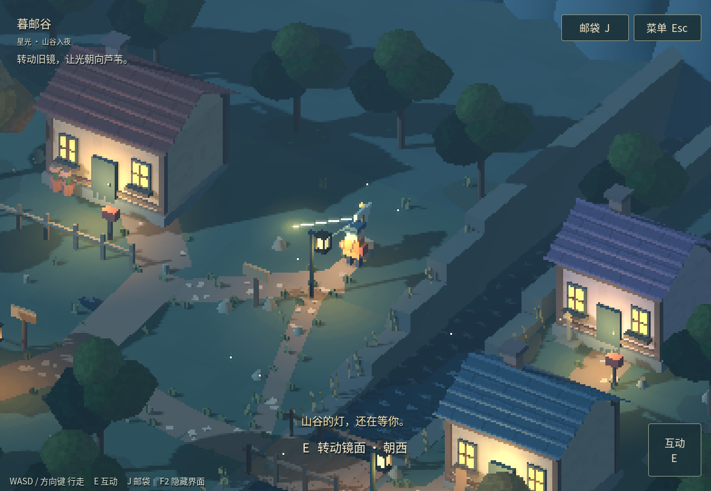

# 暮邮谷 · Dusk Post Valley

一段雨后山谷里的像素邮路。寻找三封散落的信，点亮路灯、转动旧镜，把思念送到三扇窗前。独立原创 Godot4.6.3 原型，当前游戏版本 v0.3-r1。

**[打开试玩](https://thysummer14.github.io/dusk-post-valley/)** · [操作与运行](#操作) · [开发复盘](docs/DEVELOPMENT_LESSONS_ZH.md) · [构建说明](BUILDING.md) · [测试说明](TESTING.md) · [更新记录](CHANGELOG.md)

## 操作

- 电脑：WASD或方向键移动，E/空格互动，J/Tab邮袋，Esc菜单。
- 手机推荐横屏：左半屏拖动行走，靠近物件后点右下互动。
- 进度保存在当前浏览器；清理站点数据、隐私模式或换设备可能丢失该份进度。

浏览器需要WebGL2、WebAssembly及gzip DecompressionStream。引擎采用单线程官方Godot4.6.3 Web模板，首次下载约10MB。页面会明确显示缺失能力，不会把启动失败显示成游戏成功。

## 在Godot中运行

用Godot4.6.3打开 [game/project.godot](game/project.godot)，运行主场景。无需账号、API密钥或联网服务。场景为固定斜俯视真3D、低分辨率世界与清晰中文UI。

## 验证状态

174项规则、存档、路线与布局断言通过。原生键鼠分段检查覆盖第三封的灯镜解谜、拾取、过桥、沿东岸到屋门及送达。外部窗口抢焦点造成的一次暂停经检查点续测处理，没有把它当成游戏输入缺陷。完整控制器测试覆盖返邮亭结尾。

Web资源有实际gzip解码、完整性校验和WASM编译测试；这不等于手机实玩已经验收。真实手机触屏、移动性能与声音听验仍待验证。

## 文件入口

- `game/`：完整可编辑Godot工程与测试
- `docs/`：GitHub Pages静态试玩文件，保留显式gzip解码兼容层
- `tests/`：Web载入和项目子路径资源测试

每一段验证后的变更用独立Git提交保存。发布文件只随已验证版本更新，更新内容记在CHANGELOG。源代码与试玩均公开；原创内容及第三方组件的权利说明见 [LICENSE.md](LICENSE.md)。
