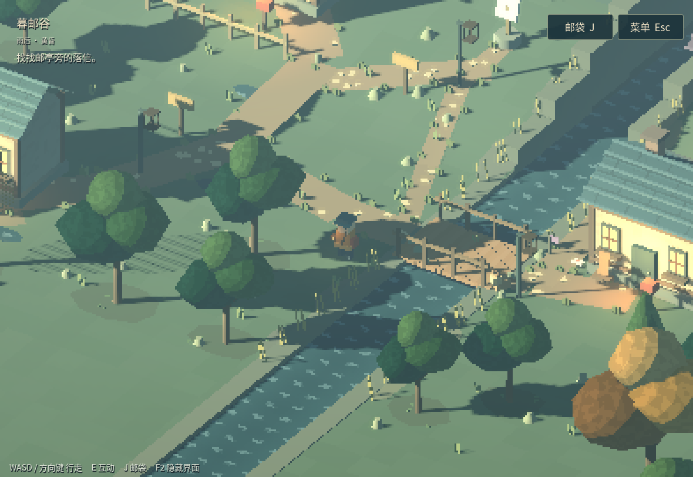
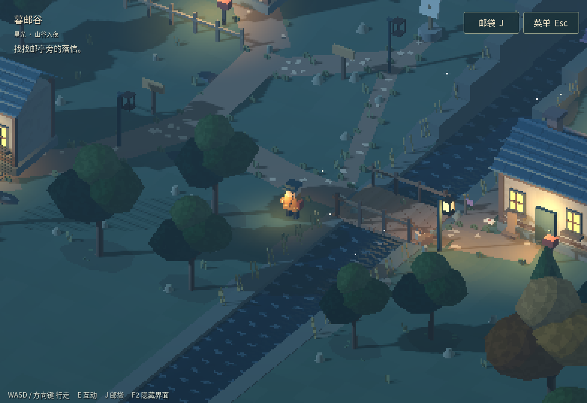

# 一次小水面实验：统一法线，收住碎光

本轮接着 v0.3-r1 做视觉调整，邮路、碰撞和存档规则不变。目标是让河水比原来的密集白碎纹安静一些，并在近岸保留细小的颜色变化。

## 实际改了什么

旧材质先用未扰动的法线计算 Fresnel，最后才改 `NORMAL` 给灯光使用。同一个水波因此有两套朝向。新版从同一波高函数的解析斜率求法线，先在世界空间处理，再转到视空间；Fresnel、暖色反光权重和实际受光共用这一结果。顶点的基础法线经 `MODEL_NORMAL_MATRIX` 转换，兼顾雨后水洼已有的非均匀缩放。

Fresnel 表示掠着水面看时反射比例变大。这里明确使用固定正交相机的平行视线，没有套用透视相机的深度公式。水面仍是风格化天空色与局部灯条混合，不是周围房屋的真实镜像。

岸线使用现有直河岸两侧内缘的世界距离，形成默认 0.35 米宽的浅色带，并在近岸减弱波坡度。边界由生成岸体的同一组尺寸传入材质，雨后水洼不套用河道遮罩。这是**美术岸线遮罩**，不能解释成测量到了真实水深。

首轮夜图中，统一权重后桥灯反光被压弱。第二轮只把已有灯条的基础权重从 0.62 调到 0.90、发光贡献从 0.28 调到 0.40。范围、全场曝光和灯的数量不变；没有把整条河染黄。

三个主要参数在 [water.gdshader](../game/shaders/water.gdshader)：`wave_slope = 0.08`、`shore_width = 0.35`、`reflection_weight = 0.45`。材质的 `enhanced_water = false` 保留 v0.3 的着色退路。`sample_time` 默认 -1，只有复测时设为固定相位。

## 同机位对照

下图均为实际 Godot 图形输出，世界视口 392×270、窗口 1180×812。相机位置相同，水波相位固定在 12 秒，前后没有更改全场曝光。日间未点灯，因此后续灯条系数修正不影响该组。

| 时刻 | v0.3 退路 | 新水面 |
| --- | --- | --- |
| 日间 |  |  |
| 夜间，桥灯开启 |  |  |

白色碎纹明显减少。夜水仍偏暗，岸带与暖色反光保持克制；这是一轮小改进，尚未解决所有河岸造型和夜间层次问题。

## 成本与验证边界

没有新增纹理采样、屏幕拷贝或绘制调用，也没有深度读取、SSR 或额外反射视口。代价是水像素内的少量数学计算。两次原生检查都未出现 shader 编译错误，174 项游戏回归仍通过。

首轮同机位交替四个 8 秒区间，旧水面中位帧时间为 45.133 / 44.703 毫秒，新水面为 43.062 / 44.583 毫秒。最终灯条调整后的重复检查，最近一次为旧 47.464、新 44.811 毫秒；P95 分别为 63.999 和 55.640 毫秒。绘制调用均为 506。没有观察到超过 5% 的中位退化，差异也不足以证明新版更快。

这些数据来自限制资源的云端 Mesa llvmpipe 软件渲染环境。驱动没有接受关闭垂直同步的请求，因此它们不是严格 GPU 基准，更不能外推成手机帧率。移动段保留实际控制器运动的原始帧与时间戳；低频采帧适合查明显跳变，无法排除所有高频闪烁。真实手机、触屏和声音仍需单独验收。

复测入口为 [water_visual_probe.gd](../game/tests/water_visual_probe.gd)，需真实图形环境并传 `--test-world`；它使用隔离测试状态，不写玩家进度。

## 研究怎样影响了实现

本轮参考研究比较了 [Miniature](https://github.com/mateuskreuch/minecraft-miniature-shader)、[MakeUp Ultra Fast](https://github.com/javiergcim/MakeUpUltraFast) 和 [Photon](https://github.com/sixthsurge/photon) 的水、雾及品质分级思路。落地的是通用方法：统一坐标空间、给效果明确预算、保留低成本退路。没有复制这些项目或 Complementary 的 shader 段落。

具体 API 语义以 [Godot 4.6 spatial shader 文档](https://docs.godotengine.org/en/4.6/tutorials/shaders/shader_reference/spatial_shader.html)为准。Minecraft 光影的深度缓冲与 Godot 外层 TextureRect 并不等价，本轮没有通过展示层尝试读取另一个 3D 视口的深度。

[返回完整开发复盘](DEVELOPMENT_LESSONS_ZH.md) · [试玩](https://thysummer14.github.io/dusk-post-valley/)
